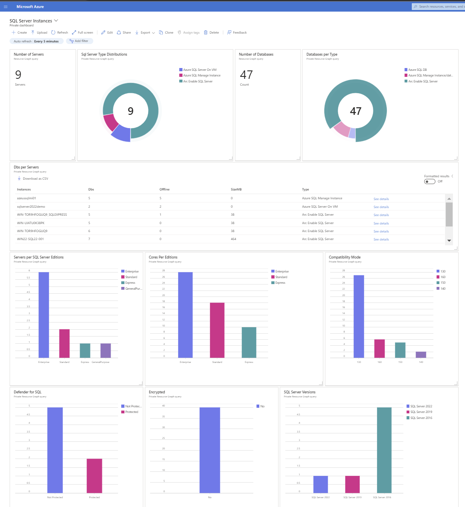

# How to Enable Azure Dashboard for SQL Server enabled by Azure Arc
This article will show you how to use the dashboard .json files in this directory to create custom dashboards in the [Azure portal](https://learn.microsoft.com/en-us/azure/azure-portal/azure-portal-dashboards).

### Steps to Follow

1. Log in to [Azure Portal](https://portal.azure.com/)
2. Click on **Dashboard** from the Azure Portal menu. You may already see the dashboard view by default.

3. Choose **Upload**.

4. If you want to edit the dashboard, please refer to this [link](https://learn.microsoft.com/en-us/azure/azure-portal/azure-portal-dashboards#edit-a-dashboard).

# Dashboard Directory
 - **Arc - Deployment Progress:** A dashbaord showing the progress of deploying Azure Arc to enable your SQL Server, Windows Server, and Linux servers.
 - **Arc - ESU:** A dashboard showing the current licensing configuration for Extended Security Updates (ESU) for SQL Server and Windows Server.
 - **Arc - Estate Profile:** A dashboard showing summary and detailed view of SQL Server, Windows Server, and Linux servers enabled by Azure Arc.
 - **Arc - SQL Server Inventory:** A dashboard showing detailed stats about SQL Server instances and servers hosting SQL Server.
 - **SQL Server Instances:** A dashboard focused on SQL Server inventory details about SQL Server instances and databases.
 - **Arc - Server Deployment:** A dashboard showing a mix of server and SQL Server details, especially useful during initial onboarding and for inventory.

# Acknowledgements
Many thanks to the following contributors that provided content to this part of the SQL Server samples repository.
- [Tps99](https://github.com/tps99)
- [batuhan-yildiz](https://github.com/batuhan-yildiz)

## Disclaimers
The code included in these samples are not intended to be a set of best practices on how to build scalable enterprise grade applications. This is beyond the scope of this quick start sample.
