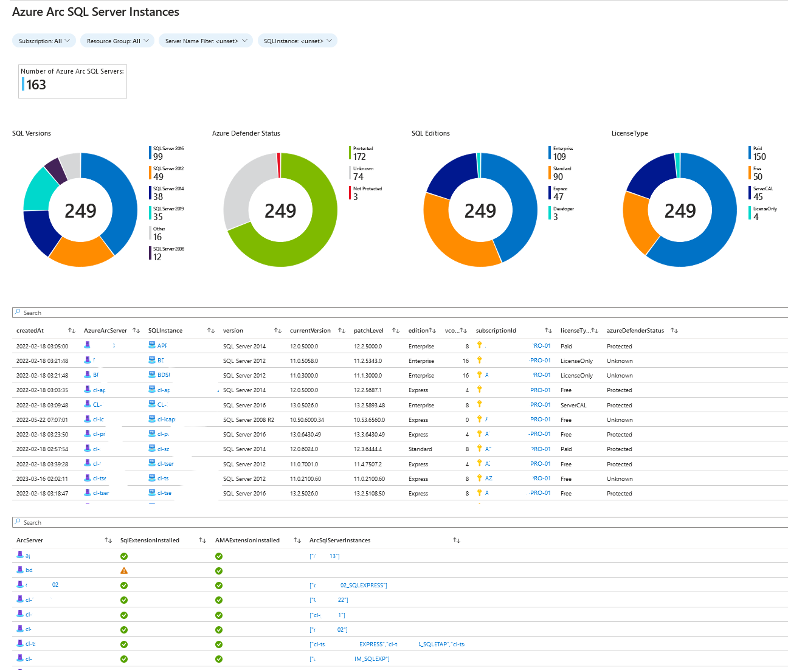
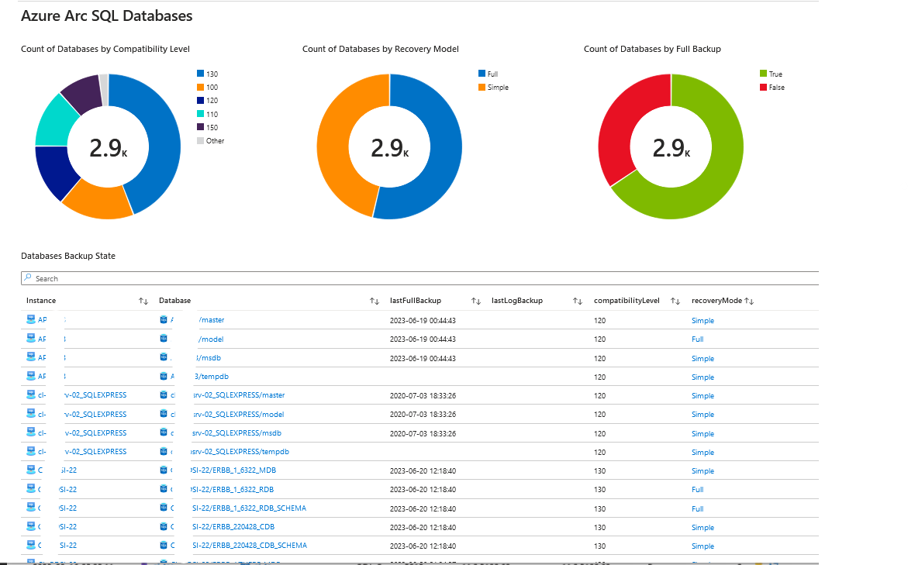
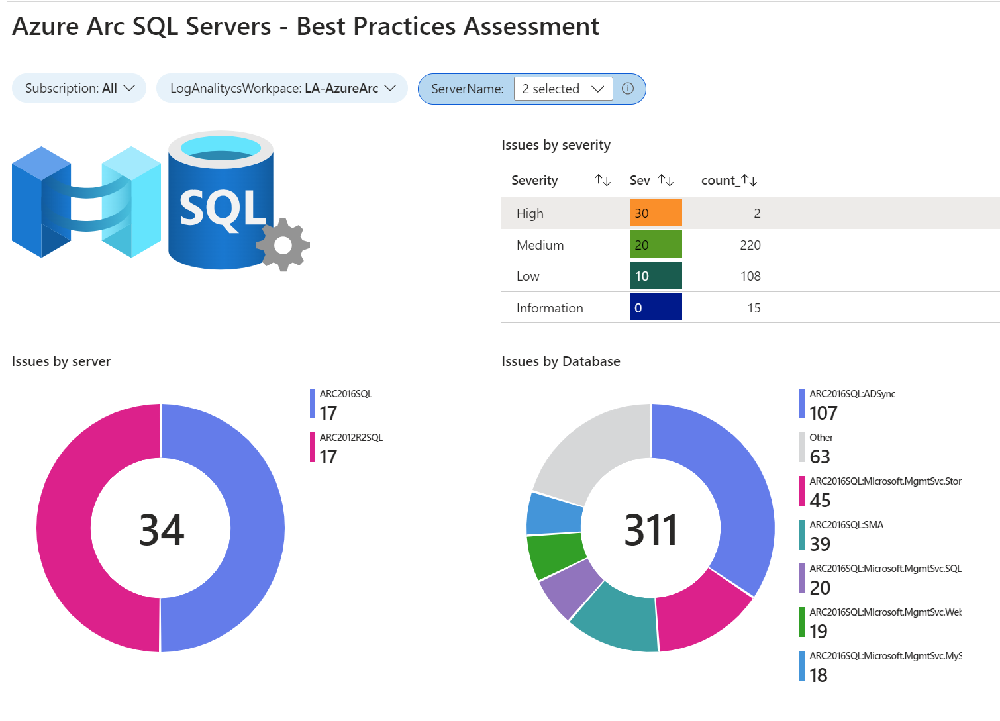
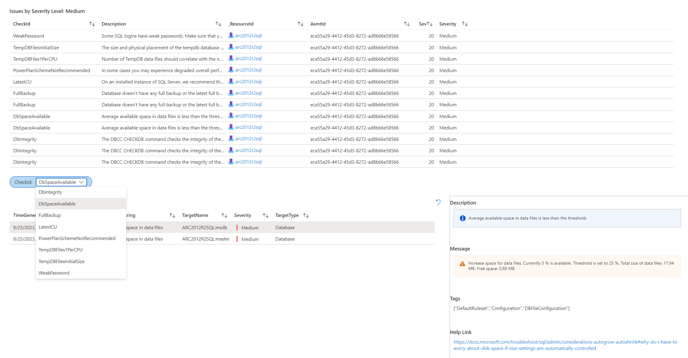

# Azure Arc SQL Server Workbooks
This section contains workbooks to use with Azure Arc SQL Servers. Please follow this article from Microsoft Learn for instruccion about how to install them :
[Creating an Azure Workbook](https://learn.microsoft.com/en-us/azure/azure-monitor/visualize/workbooks-create-workbook#create-a-new-azure-workbook)

## Azure Arc SQL Instances

## Azure Arc SQL Databases

## Azure Arc SQL Best Practices Assessment

## Disclaimers
The code included in this sample is not intended to be a set of best practices on how to build scalable enterprise grade applications. This is beyond the scope of this quick start sample.
