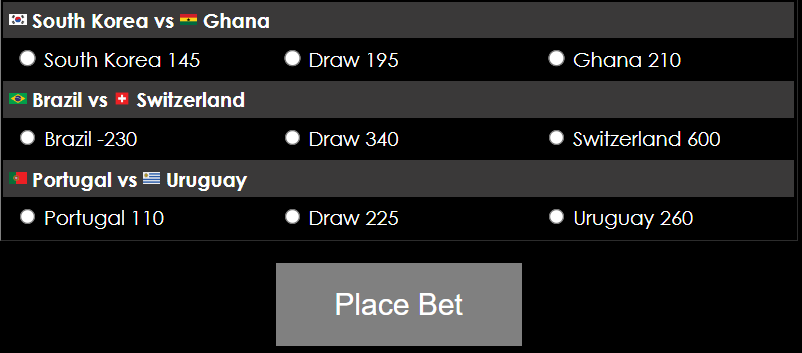
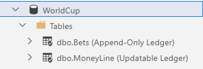

# Ledger SQL Server - Demo

The demo in this folder showcases the [ledger](https://docs.microsoft.com/en-us/azure/azure-sql/database/ledger-overview) feature in SQL Server. The demo uses the Contoso World Cup application.

## Content

[About this sample](#about-this-sample)
[Before you begin](#before-you-begin)
[Setup](#setup)
[Demo - show the main benefits of the ledger feature](#Demo---show-the-main-benefits-of-the-ledger-feature)

## About this sample

- **Applies to:** SQL Server 2022 (16.x)
- **Key features:** Ledger
- **Workload:** World Cup Betting application
- **Programming Language:** C#, Transact-SQL
- **Authors:** Pieter Vanhove
- **Update history:**

## Before you begin

Before you begin, you need an Azure subscription. If you don't already have an Azure subscription, you can get one for free [here](https://azure.microsoft.com/free/).

You also need to make sure the following software is installed on your machine:

1. [SQL Server 2022](https://www.microsoft.com/en-us/sql-server/sql-server-downloads). Even SQL Server 2022 Express edition should be sufficient for this demo.
1. [Visual Studio Code](https://code.visualstudio.com/download).
1. [SQL Server Management Studio (SSMS)](https://learn.microsoft.com/en-us/sql/ssms/download-sql-server-management-studio-ssms?view=sql-server-ver16) - version 18.12.1 or later is required.
1. [Azure Data Studio](https://learn.microsoft.com/en-us/sql/azure-data-studio/download-azure-data-studio?view=sql-server-ver16) - version 1.41 or later is required.

## Setup

### Azure Storage Account
1. Go to the [Azure Portal](https://portal.azure.com/) and create a new resource group that will be used for the demo environment.
1. Create a new Azure Storage Account in the resource group. Make sure you [enable version-level immutability support on the storage account](https://learn.microsoft.com/en-us/azure/storage/blobs/immutable-policy-configure-version-scope?tabs=azure-portal#enable-version-level-immutability-support-on-a-storage-accountconfigure) to ensure that database digests are protected from tampering. Make sure the immutability policy allows protected append writes to append blobs and that the policy is locked.
1. Follow the steps on [Azure Storage account permission](https://learn.microsoft.com/en-us/sql/relational-databases/security/ledger/ledger-digest-management?view=sql-server-ver16#azure-storage-account-permission) to create a credential on the SQL Server Instance.

### Database

1. Clone/download and unpack the repository.
1. Open SQL Server Management Studio and connect to your SQL Server 2022 instance.
1. Open the file [CreateDatabaseSchemaAndPopulateDatabase.sql](../sql-server/setup/CreateDatabaseSchemaAndPopulateDatabase.sql)
1. Go to line 12 and replace **YourStorageAccountName** with the name of the Azure storage account you just created.
1. Run the script. This will
    1. Create the database.
    1. Create the database schema.
    1. Create a function to calculate the payout.
    1. Create a stored procedure to place bets.
    1. Configure the automatic digest storage.
    1. Populate the database.

### Web Application

1. Open Visual Studio.
1. Open the folder [WorldCup](../source/WorldCup/).
1. Click on the file Program.cs in the Explorer and go to line 25.
1. Change the *Server* parameter in the connection string to the name of your SQL Server Instance.
1. Save your modifications.

## Demo - show the main benefits of the ledger feature

### Scenario

Contoso Cup Betting is using a simple web application where people can place bets, in this case bets on soccer games.

In this demo you will use 2 different types of users:

- Pieter, the DBA of the company.
- Michael, who is an internal auditor.

All the games and bets need to be immutable. Using ledger tables is a good solution for this since the data of all the bets and the games needs to be fully trusted. It prevents the company from removing or updating any placed bets. Pieter, who has placed a few bets on some games, wants to maliciously increase his payout. Unfortunately for Pieter, the bets table is an append-only ledger table, which means he can't change his bets with regular T-SQL updates. Pieter knows how to tamper with the data directly in the data file and thinks his change will never be noticed. However, Michael reviews the Worldcup database after the tournament is over and noticed that the verification procedure fails, which means that the data cannot be trusted.

### Prepare for the demo

Perform the below steps before you show the demo.

1. Connect to the database.
   1. Start the Azure Data Studio.
   1. Open the Notebook [Ledger - World Cup Demo - SQL Server 2022](../sql-server/tsql-scripts/Ledger%20-%20World%20Cup%20Demo%20-%20SQL%20Server%202022.ipynb).
   1. Attach the Notebook to the SQL Server Instance and WorldCup database you have created during the demo Setup.

1. Prepare a browser window.
   1. Open Visual Studio.
   1. Open the folder [WorldCup](../source/WorldCup/).
   1. Go to the top menu and click *Terminal - New Terminal*.
   1. In the terminal window type *dotnet run*. This will launch the web application.
   1. Open your browser and enter the following URL *http://localhost:3000*.

### Demo steps

1. Show the app and the database.
   1. Show the Contoso World Cup web app in the browser. Explain that this is a list of all the soccer games. Show that you are logged in as Pieter (the DBA of the company), fill in an amount and place a bet.
   
   1. Once you have placed the bet, show that the user can download a cryptographic receipt of his/her bet. This receipt could also be used to verify the database afterwards but this is not part of the demo.
   
   1. Go to the Notebook and show the 2 tables, *Moneyline* and *Bets* in the Explorer. Explain that *Moneyline* table is an updatable ledger table and *Bets* an append-only ledger table.

   
   1. Run the `code cell 1` in the Notebook to show the games in the *Moneyline* table.

1. Show how ledger captures history information in the updatable ledger table.
    1. Pieter has been asked to change the Home Country Odds for the game with ID 1. Run `code cell 2` in the Notebook to update the record.
    1. Run `code cell 3` in the Notebook to show the history of the updated record. Explain that updates are stored as 2 records in the history table. A delete of the old version and an insert of the new version of the row.

1. Show how append-only ledger table works and how ledger helps investigate tampering by DBAs.
    1. Michael, who is an internal auditor, performs a routine review of changes in the Worldcup database. As his first step, Michael runs the ledger verification to be sure he can trust the data he’s going to examine. Run `code cell 4` to execute the verification stored procedure. The result should be "Ledger verification succeeded."
    1. Pieter wants to maliciously increase his payout for the game he betted on. Run `code cell 5 and 6` to try to update the record. Explain that update on an append-only ledger table is blocked.
    1. Pieter thinks he's smart and tampers with the data directly into the data file by using a stored procedure. **DO NOT RUN** `code cell 7` because the stored procedure does not exists.
    1. Michael, reviews the Worldcup database again after the tournament is over. He noticed that the verification procedure failed. Observe the results of `code cell 8` to see evidence of tampering in a database ledger. **DO NOT RUN** the cell just review the pre-run results to see tampering in action.
    1. Review the history of the transaction and show to the audience that you can verify which transactions cannot be trusted. Observe the results of `code cell 9` but **DO NOT RUN** the cell just review the pre-run results.

## Key Takeaways

Ledger makes your data tamper-evident and cryptographically verifiable, which helps ensure non-repudiation, eliminating a need to run laborious manual audits and time-consuming investigations.
