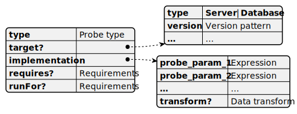

# Probe

A *Probe* is a JSON property. The property name is the probe ID used in checks. The property value is an array of [probe implementations](#probe-implementation). The SQL Assessment API engine selects the first implementation with matching target pattern. This means that the order of the implementations in the array is important. A probe can be comprised by a mix of CLR and SQL implementations.

Another ruleset may add probe implementations on top of the list.

A probe should be designed as a function with no side effects. The order of calling probes is not determined. The engine may reorder probe calls to optimize the target SQL Server load. When no check needs data from a probe, that probe will not be called.

Probes from the default rule set read metadata only, e.g. update logs or server properties. They do not read user data from tables or write anything to databases or instances. Probes do not set any flags or properties.

## Probe implementation

Probe implementation is represented by a JSON object. Its properties define procedures for getting data and selecting appropriate implementation.

## Probe properties

### implementation

The `implementation` property contains probe parameters and [data transformations](DataTransformation.md) affecting the probe output. For example, for a T-SQL probe the main parameter is the query for selecting data.

Probe parameters are specific for [probe type](#type).

### requires

Explicit  functional [requirements](./ProbeRequirements/README.md) for this probe. SQL Assessment API checks if all the requirements are met. If not, the probe is not executed, all dependent checks are skipped, and a warning is returned.

### runFor

Explicit logical [requirements](./ProbeRequirements/README.md) for this probe. SQL Assessment API checks if all the requirements are met. If not, the probe implementation is not executed and an empty result set is returned immediately.

### target

Target object [pattern](TargetPattern.md).

### type

Probe `type` determines the mechanism used to get data. it may be a T-SQL or a WMI. Available probe types are listed in the following table.

| Type                                                | Description              |
|-----------------------------------------------------|--------------------------|
|[AzGraph](../Reference/Probes/AzGraphProbe.md)       | Kusto query to Azure resource graph |
|[AzMetadata](../Reference/Probes/AzMetadataProbe.md) | JSONPath for the object returned by Azure Instance Metadata Service |
|[CMD](../Reference/Probes/CMDShellProbes.md)         | Command shell script run on the target machine |
|[External](../Reference/Probes/ExternalProbe.md)     | Arbitrary .NET code      |
|[PowerShell](../Reference/Probes/PowerShellProbes.md)| PowerShell script        |
|[Registry](../Reference/Probes/RegistryProbes.md)    | Data from registry       |
|[SQL](../Reference/Probes/TSQLProbes.md)             | T-SQl query              |
|[WMI](../Reference/Probes/WMIProbes.md)              | WMI query                |
