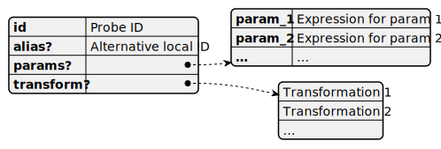

# Probe reference

Data for checks comes from probes. Probe reference is a JSON object that describes a probe needed by the check. When a probe is referenced with no additional options or parameters, a probe reference may be abbreviated to a string containing probe ID.



## Properties

### alias

An alternative name used for this probe.

Alias is an alternative name for the probe which can be used in expressions in this check. It is useful in two scenarios: [calling a probe multiple times](#calling-probe-multiple-times) and [passing data from one probe to another one](#using-data-from-another-probe).

### id

Referenced probe ID.

### params

Parameters passed to the probe called for this check. They are represented as properties of a JSON object. Property name is the parameter name while property value can be any [expression](Expression.md). Expression can include constants, global and local variables, and data returned by other probes (see [alias](#alias)).

### transform

Data transformation applied to the data before calculation the condition value, see [Data transformation](DataTransformation.md).

## Calling probe multiple times

For some checks you may need to call a probe multiple times with different parameters. In this case add multiple probe references with the same `id`. To distinguish results returned for different parameters prepend the output variable name with probe alias and double colon '::'.

The following check compares f4ree space on disks C: and D:.

```json
"probes": [
    {
        "type": "DiskInfo",
        "alias": "FirstDisk",
        "params": {
            "DiskName": "C:"
        }
    },
    {
        "type": "DiskInfo",
        "alias": "SecondDisk",
        "params": {
            "DiskName": "D:"
        }
    }
],
"condition": {
    "greater": [
        "@FirstDisk::FreeSpace",
        "@SecondDisk::FreeSpace"
    ]
}
```

## Using data from another probe

Data returned by one probe can be passed to another one as a parameter. The expression for the parameter should contain the output variable name prefixed with the previous probe id or alias.

In the following example *DatabaseMasterFiles* probe finds volume IDs for all disks used by the target database. The *AzStorage* probe is called for each volume ID and adds  Azure related storage properties along with volume ID.

```json
"probes": [
    {
        "id": "DatabaseMasterFiles",
        "alias": "db_files",
        "params": {
            "dbId": null,
            "type": null
        },
        "transform": [
            {
                "type": "aggregate",
                "group": [
                    "volume_mount_point",
                    "volume_id"
                ]
            },
            {
                "type": "aggregate",
                "group": "volume_id",
                "map": {
                    "volume_mount_point": "join"
                }
            }
        ]
    },
    {
        "id": "AzStorage",
        "params": {
            "path": "@db_files::volume_id"
        }
    }
]
```