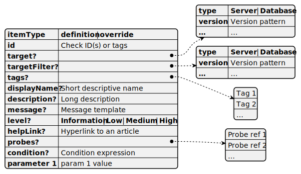

# SQL Assessment API Rule

A rule is represented by a JSON object. A rule applies its properties to a new or existing check.

## Rule properties

### itemType

__Allowed values:__ *definition*, *override*

This property specifies whether this rule defines a new check or modifies an existing one. A check can be modified by more than one rule.

### tags

An array of short strings used to categorize checks. For example, checks marked with the "Memory" tag are coming from memory-related best practices. Single-word tags work best.

### id

An ID of the check to be defined or modified by this rule.  A check can be modified by more than one rule.

An array of IDs or tags of checks to be modified by this rule. A rule can modify multiple checks at once. Checks are selected either by ID or by tag. If multiple tags are specified, every check having _any_ listed tag will be affected by this rule.

### target

Target pattern is a JSON object used to select applicable rules. A rule will be applied if the assessed object matches the `target` pattern. For more information, see [Target pattern](./TargetPattern.md).

### targetFilter

Target pattern with the same syntax as the target property, but used exclusively in overrides. For more information on the usage and object format, see [Overrides](./RulesandProbes.md) and [Target pattern](./TargetPattern.md), respectively.

### displayName

Short display names are shown in checklists. You may think of a display name as of a file name if a rule was stored in a separate file. Usually, the display name tells what the check is looking for.

### message

A string which is used as a template for generating messages to the user. Such a message appears when the check detects configurations that are not in compliance with the best practice recommendation. For more information, see [Message template](./MessageTemplate.md).

### description

Long description that explains why the check looks for this particular issue. It briefly discusses the impact of the detected issue.

### helpLink

Hyperlink to an article that explains the best practice recommendations and remediation suggestions.

### level

__Allowed values:__ `Information`, `Low`, `Medium`, `High`

The severity level of the issue detected by this check.

### probes

The `probes` array contains references to probes to be used to get data required by this check. For more information, see [Probe References](./ProbeReference.md).

### condition

Condition is an expression in form of JSON object tree. It uses check parameters and data from probes This expression should return _true_ when the best practice found implemented. If condition evaluates to _false_, the message is displayed to the user.

### parameters

Arbitrary properties passed to conditions, message templates, probe parameters, and transforms along with the data from probes.