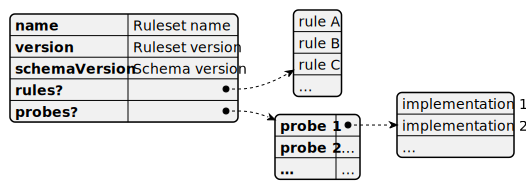

# Ruleset file structure

Rule set is stored in a text file that contains a JSON object. The rule set object has three simple mandatory properties: `name`, `version`, and `schemaVersion`. The latter specifies the file format version. As of the time of writing this document, the file format version is 1.0. The `name` and `version` properties comprise the identity of the set.

An essential part of a ruleset is the optional `rules` property that stores an array of SQL Assessment API rules. Rules are used to build a checklist. For more information, see [Understanding Rules and Probes](./RulesandProbes.md).

The optional `probes` property contains definitions for probes. Probes are used to get actual data from target SQL Server instances, hosting machines, and other sources. Each probe definition is a JSON array of one or more implementations. For more information, see [Probes](../Reference/Probes/README.md).

The `rules` and `probes` properties are optional because rules from one ruleset can use probes from another one.



```json
{
     "name": "Ruleset name",
     "version": "Ruleset version",
     "schemaVersion": "Schema version",
     "rules":[
          {
               … rule A …
          },
          {
               … rule B …
          },

          …
     ],
     "probes":{
          "probe1": [
               {
                    … implementation 1 …
               },
               {
                    … implementation 2 …
               },

               …
          ],
          "probe2": [
               …
          ],

          …
     }
}
```

Ruleset examples:

- [DisablingBuiltInChecks_sample.json](https://github.com/microsoft/sql-server-samples/blob/master/samples/manage/sql-assessment-api/DisablingBuiltInChecks_sample.json)

- [MakingCustomChecks_sample.json](https://github.com/microsoft/sql-server-samples/blob/master/samples/manage/sql-assessment-api/MakingCustomChecks_sample.json)