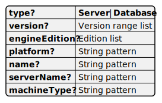

# Target pattern

Target pattern specifies criteria for filtering rules and probe implementations. A rule will be applied to those SQL Server instances and databases, which match the rule's [target](./Rule.md#target) pattern.

this mechanism allows rules specific to certain SQL Server versions or editions, or even specific to a certain database. When used in custom rulesets, SQL Server instances can be distinguished by name to apply different rules. For example, servers servers used for application development might not need frequent backups.

## Target pattern structure

Target pattern is represented by a JSON object of the following structure. All properties are optional. Every value is a match when a property is omitted.



### engineEdition

__Allowed values__: `PersonalOrDesktopEngine`, `Standard`, `Enterprise`, `Express`, `AzureDatabase`, `DataWarehouse`, `StretchDatabase`, `ManagedInstance`;

`Azure` =  `AzureDatabase`, `DataWarehouse`, `StretchDatabase`, `ManagedInstance`;

`SqlServer` = `PersonalOrDesktopEngine`, `Standard`, `Enterprise`, `Express`.

Any combination of comma-separated values above is allowed. Lists SQL Server engine editions matching this target pattern. `Azure` and `SqlServer` are short names for frequently used lists.

In the following example __engineEdition__ is any on-premises edition or Azure Managed Instance.

```json
"engineEdtion": "SqlServer, ManagedInstance"
```

### name

A [string pattern](#string-pattern) for the target SQL
Server object name. It's a database name or an instance name.

In the following example __name__ matches anything except _master_, _tempdb_, and _model_.

```json
"name": { "not": [ "master", "tempdb", "model"]}
```

### machineType

A [string pattern](#string-pattern) for the type of machine hosting target SQL Server instance.

Supported machine type values are: `Physical`, `AzureVm`, `Hypervisor`, `Other`.

In the following example any physical or Azure virtual machine mathes the pattern.

```json
"machineType": ["AzureVm", "Physical"]
```

### platform

A [string pattern](#string-pattern) for the platform of machine hosting target SQL Server instance.

Supported machine type values are: `Windows`, `Linux`.

In the following example Windows and Linux installations match.

```json
"platform": ["Windows", "Linux"]
```

### serverName

A [string pattern](#string-pattern) for the SQL Server instance name. If target is a SQL SErver instance, then _serverName_ equals _name_, otherwise it's the name of SQL Server instance hosting the target object.

In the following example all instances match except those with names ending with _Test_.

```json
"serverName": {"not": "/*.Test$/"}
```

### type

__Allowed values__: `Server`, `Database`.

Any comma-separated list of allowed values defines which type of SQL Server object matches this pattern.

Check's target is always either `Sever` or `Database`. For a probe it's often both.

In the following example only databases match the pattern.

```json
"type": "Database"
```

### version

A [version pattern](#version-pattern) specifying ranges of matching SQL Server versions.

In the following example the pattern matches SQL Server 2016 SP2+, 2014 SP3+, and 2019+.

```json
"version": ["[13.0.5026.0, 14.0)", "[12.0.6024.0, 13.0)", "[15.0)"]
```

## String pattern

String pattern defines matching strings. It can be a string, a JSON object, or a JSON array of string patterns. With arrays, string patterns have a recursive structure. An array matches a string when any of its elements is a match.

A string pattern can be an arbitrary string. In this case SQL Assessment API looks for an exact match.

When the string starts and ends with slash '/' ti represents a [regular expression](#regular-expression).

When string pattern is represented by a JSON object, it may have only one property named __not__. The property value must be any string pattern. This means that the pattern matches anything which is not a match for the __not__property value.

For example, the following matches anything that does not end with _Test_.

```json
{ "not": "/*.Test$/c" }
```

### Regular expression

Regular expressions are enclosed in slashes: `"/Win*./"`. Regular expression options can be specified after the closing slash. For example, this is the case sensitive search: `"/win.*/c"`. If the string does not start with a slash, it is treated as an exact string match. The string "_Linux_" is equivalent to the regular expression "_/^Linux$/_".

SQL Assessment API supports [.NET Regular Expressions.](https://learn.microsoft.com/dotnet/standard/base-types/regular-expressions).

Regular expression options are listed in the [Regular expression options](https://learn.microsoft.com/dotnet/standard/base-types/regular-expression-options) article.

__NOTE:__ Regular expressions are case-insensitive by default. For case-sensitive matching use 'c' option.


## Version pattern

The version range list is a single [version range](#version-range) or an array of version ranges. A single version range is equivalent to an array containing the only element. The version range list matches any version matching any of its ranges.

```json
"version": [
    "[10.0.4326,10.0.4371]",
    "[10.0.5794,10.50)",
    "[10.50.2806,11.0)",
    "[11.0.2316,)"
]
```

### Version range

A range of versions is encoded by a string. The string contains one or two versions delimited by the comma and enclosed into optional parenthesis or brackets. If there are two versions, the former version must be less than or equal to the latter. They represent the range boundaries. The version must be specified at least by two numbers separated by the period: major and minor version numbers.

Th version range format follows [Nuget version range format](https://learn.microsoft.com/nuget/concepts/package-versioning#version-ranges).

|Version Range|Matches|
|-|-|
|"10.0"|Version 10.0 exactly.|
|"[10.0, 13.0]"|Anything between 10.0 and 13.0, inclusive: 10.0, 10.50, 11.0.345, 13.0.|
|"(10.0, 13.0)"|Anything between 10.0 and 13.0, exclusive: 10.50, 11.0.345. Does not match 10.0 or 13.0.|
|"[10.0, 13.1)"|Anything between 10.0 and 13.1, excluding the right boundary: 10.0, 10.50, 11.0.345, 13.0, 13.0.234. Does not match 13.1.|
|"(10.0, 13.1]"|Anything between 10.0 and 13.1, excluding 10.0.|
|"[10.0,)"|10.0 and abo|
|"(10.0,)"|Above 10.0, but not itself|
|"(,10.0]"|10.0 or below|
|"(,10.0)"|Below 10.0, but not 10.0.|
