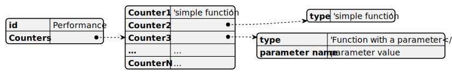

# Data transformation: **performance**

Performance probe returns a table containing multiple samples for all requested counters. A check needs some derived value. E.g. average, maximum, more complex functions.

Use the *Performance* transform in [probe references](../../Customization/ProbeReference.md) to get derived values. Performance transform calculates specified derived value for each counter used by the check.



## Derived value functions

The following table lists available performance value functions.

- **n** – number of samples for this counter
- **c₁**, **c₂** – sample values for this counter
- **t₁**, **t₂** – time stamps for samples
- **b₁**, **b₂** – sample values for *base_counter*

| Type        | Parameter      | Formula                                            |
|-------------|:--------------:|:--------------------------------------------------:|
| average     |       –        | $\frac{1}{n}\sum_{i=1}^n c_i$                              |
| delta_ratio | *base_counter* | $\frac{c_2 - c_1}{b_2 - b_1}$                      |
| min/max     |       –        | Minimum/maximum of all samples                     |
| rate        |       –        | $\frac{c_2 - c_1}{t_2 - t_1}$                      |
| ratio       | *base_counter* | $\left(\frac{c_2}{b_2} + \frac{c_1}{b_1}\right)/2$ |

## Example ruleset

The following JSON object represents a complete rule set using performance counters.

```json
{
    "schemaVersion": "1.0",
    "name": "Performance Checks Example",
    "version": "1.0",
    "rules":[
        {
            "target": { "type": "Server" },
            "id": "TotalPages",
            "itemType": "definition",
            "displayName": "Buffer Manager Total pages",
            "description": "Use \"average\", \"min\", or \"max\" for counter type PERF_COUNTER_LARGE_RAWCOUNT(65792).",
            "message": "Total pages (@{total_pages}) is greater than 0",
            "condition": {
                "lt": ["@total_pages", 0]
            },
            "probes": [
                {
                    "id": "PerformanceProbe",
                    "transform": {
                        "type": "performance",
                        "counters": {
                            "total_pages": "average"
                        }
                    }
                }
            ]
        },
        {
            "target": { "type": "Server" },
            "id": "CacheHitRatio",
            "itemType": "definition",
            "displayName": "Buffer Manager cache hit ratio",
            "description": "Use \"ratio\" for counter type PERF_LARGE_RAW_FRACTION(537003264) and specify base PERF_LARGE_RAW_BASE(1073939712).",
            "message": "Cache hit ratio (@{cache_hit_ratio:P0}) is greater than 0",
            "condition": {
                "lt": ["@cache_hit_ratio", 0]
            },
            "probes": [
                {
                    "id": "PerformanceProbe",
                    "transform": {
                        "type": "performance",
                        "counters": {
                            "cache_hit_ratio": {
                                "type": "ratio",
                                "base": "cache_hit_ratio_base"
                            }
                        }
                    }
                }
            ]
        },
        {
            "target": { "type": "Server" },
            "id": "LatchWaitTime",
            "itemType": "definition",
            "displayName": "Average Latch Wait Time",
            "description": "Use \"delta_ratio\" for counter type PERF_AVERAGE_BULK(1073874176) and base PERF_LARGE_RAW_BASE(1073939712).",
            "message": "Average Latch Wait Time (@{latch_wait_time}ms.) is greater than 0",
            "condition": {
                "lt": ["@latch_wait_time", 0]
            },
            "probes": [
                {
                    "id": "PerformanceProbe",
                    "transform": {
                        "type": "performance",
                        "counters": {
                            "latch_wait_time": {
                                "type": "delta_ratio",
                                "base": "latch_wait_time_base"
                            }
                        }
                    }
                }
            ]
        },
        {
            "target": { "type": "Server" },
            "id": "TransactionsPerSec",
            "itemType": "definition",
            "displayName": "Database Transactions per sec",
            "description": "Use \"rate\" for counter type PERF_COUNTER_BULK_COUNT(272696576).",
            "message": "Transactions per sec (@{transactions_sec:0.##}sec.) for database @{instance_name} is greater than 0",
            "condition": {
                "or": [{"eq": ["@instance_name", "_Total"]}, {"le": ["@transactions_sec", 0]}]
            },
            "probes": [
                {
                    "id": "PerformanceProbe",
                    "transform": {
                        "type": "performance",
                        "counters": {
                            "transactions_sec": "rate"
                        }
                    }
                }
            ]
        },
        {
            "target": { "type": "Server" },
            "id": "TotalTransactionsPerSec",
            "itemType": "definition",
            "displayName": "Total Database Transactions per sec",
            "description": "Use \"rate\" for counter type PERF_COUNTER_BULK_COUNT(272696576).",
            "message": "Total Transactions per sec (@{transactions_sec:0.##}sec.) is greater than 0",
            "condition": {
                "lt": ["@transactions_sec", 0]
            },
            "probes": [
                {
                    "id": "PerformanceProbe",
                    "transform": {
                        "type": "performance",
                        "counters": {
                            "transactions_sec": {
                                "type": "rate",
                                "instance": "_Total"
                            }
                        }
                    }
                }
            ]
        }
    ],
    "probes":{
        "PerformanceProbe": [{
            "type": "Performance",
            "implementation": {
                "Counters": {
                    "Buffer Manager": {
                        "Buffer cache hit ratio": "cache_hit_ratio",
                        "Buffer cache hit ratio base": "cache_hit_ratio_base",
                        "Target pages": "total_pages"

                    },
                    "Latches": {
                        "Average Latch Wait Time (ms)": "latch_wait_time",
                        "Average Latch Wait Time Base": "latch_wait_time_base"
                    },
                    "Databases": {
                        "Transactions/sec": "transactions_sec"
                    }
                }
            }
        }]
    }
}
```

## How to use multiple performance counters in a single check

While using multiple performance counters for different instances results might not look as expected. Take a look at the following example.

```json
"probes": [
    {
        "id": "PerformanceProbe",
        "alias": "b",
        "transform": {
        "type": "performance",
            "counters": {
                "batch_request_sec": "rate",
                "lock_requests_sec": {
                    "type": "rate",
                    "instance": "_Total"
                }
            }
        }
    }
]
```

The code worked as expected. The data transform returned two rows of data from the Performance probe:

| batch_request_sec | lock_requests_sec | instance_name               |
|:-----------------:|:-----------------:|:---------------------------:|
|              123s |              null | ‘’ *(no instance selected)* |
|              Null |              456s |                    ‘_Total’ |

The condition is checked once per row and triggers a message for the first one and an error for another.

The following JSON illustrates a solution. The Performance probe is referenced twice. The first reference gets `batch_request_sec` rate. The second one gets `lock_requests_sec` rate for the `_Total` instance. Note aliases associated with each probe reference.

```json
"probes": [
    {
        "id": "PerformanceProbe",
        "alias": "b",
        "transform": {
        "type": "performance",
            "counters": {
                "batch_request_sec": "rate"
            }
        }
    },
    {
        "id": "PerformanceProbe",
        "alias": "l",
        "transform": {
        "type": "performance",
            "counters": {
                "lock_requests_sec": {
                    "type": "rate",
                    "instance": "_Total"
                }
            }
        }
    }
]
```

[Alias](../../Customization/ProbeReference.md#alias) is any alternative name for the probe. Any data variable may be prefixed with an alias or a probe id. E.g. the following names refer to the same value in an unambiguous case:

```plain
@PerformanceProbe::batch_request_sec
@b::batch_request_sec
@batch_request_sec
```

Those two probe references result in the following data passed to the check:

| b::batch_request_sec | b::instance_name | l::lock_requests_sec| l::instance_name |
|:--------------------:|:----------------:|:-------------------:|:----------------:|
|                 123s | ‘’ no instance   |                456s |         ‘_Total’ |
